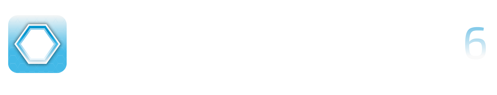

  

# DreamSync Studio 6

Professional chart editor for DreamSyncX with AI-powered auto-mapping and a beautiful, high-performance 3D gameplay engine.

**Version 6.0.0** - 3D Three.js engine migration, high-impact VFX (dynamic fireworks, camera shake on hits), deep integration of custom note properties, and total feature parity with the main DreamSyncX game!

## What's New in v6.0.0

### � Dynamic Layout Transitions
- **Three.js Migration** - Ripped out the legacy 2D PixiJS gameplay engine and replaced it with a lightning-fast, high-performance 3D pipeline.
- **Dynamic VFX** - Fireworks and immersive camera shake natively triggered by your chart hits.
- **Tail Types & Note Properties** - Total visualization of advanced note properties inside the 3D space.

### 🧹 Cleaned-Up UI & Obsolete Features Purge
- **Farewell Honeycomb-Ring** - Removed the archaic 2D 'Layout Transitions' panel as the 3D engine handles spatial routing natively.
- **Stable Statuses** - Fixed the ever-broken FPS counter polling dead PIXI tickers, now reporting accurate electron render frames.
- **Auto-Updater Resurrection** - Brought back seamless background updating via `electron-updater`.

### 🎵 Enhanced Note Types
- **EX Notes** - Special bonus notes with gold color and unique sound effect
- **EX2 Notes** - Advanced EX notes with different audio feedback
- **Multi Notes** - Simultaneous multi-zone hits with deep sky blue color
- **Color-Coded Timeline** - Easy identification of note types in the editor

### 🎆 Advanced 3D Gameplay Preview
- **Immersive Lighting & Bloom** - Your charts come alive exactly as they will look in the engine
- **Spatial Deepness** - Notes traverse 3D space with high-speed Z-depth tracking
- **Visual Feedback** - Real-time explosion fx and glowing note bodies
- **Accurate Hit Logic** - Note approach scaling and beat matching built into the preview

## Features

### Core Editing
- **Visual Timeline Editor** - Drag, place, and edit notes with precision
- **Waveform Visualization** - See your audio while charting
- **Multi-Select & Box Selection** - Edit multiple notes at once
- **Undo/Redo System** - Full history with Ctrl+Z/Ctrl+Y
- **Auto-Save** - Never lose your work
- **Real-Time Preview** - Test your chart instantly with gameplay preview
- **Note Type Selection** - Regular, EX, EX2, and Multi notes with keyboard shortcuts (1-5)

### AI Auto-Mapper
- **Intelligent Chart Generation** - AI analyzes audio and creates charts
- **Trainable Model** - Feed it osu!mania beatmaps to learn your style
- **5 Difficulty Levels** - Easy, Normal, Hard, Expert, Master
- **Musical Intelligence** - Understands song structure, energy, and phrasing
- **Onset Classification** - Distinguishes strong hits from background sounds

### Themes & Customization
- **4 Basic Themes** - Light, Dark, OLED (pure black), High Contrast
- **6 Professional Themes** - Dracula, Monokai, Tokyo Night, Nord, Solarized Dark, GitHub Dark
- **Theme Preview** - See themes before applying
- **Persistent Settings** - Your preferences are saved automatically

### Import/Export
- **DSX JSON Format** - Native format
- **osu!mania Import** - Import .osu files (experimental)
- **Batch Training** - Train AI on entire beatmap packs

---

## Getting Started

### First Launch

When you first launch DreamSyncX Chart Editor, you'll be greeted with a modern setup wizard that will guide you through:

1. **Welcome Screen** - Overview of key features (AI Auto-Mapping, Visual Timeline, Real-time Preview)
2. **EULA Agreement** - Read and accept the End User License Agreement
3. **Theme Selection** - Choose from 10 beautiful themes or stick with the default
4. **Audio Settings** - Configure volume levels for music, sound effects, and metronome
5. **Keyboard Shortcuts** - Learn essential shortcuts to boost your productivity

The setup wizard includes:
- Progress tracking with step counter and progress dots
- Keyboard navigation (Enter to continue, Escape to go back)
- Theme preview that updates the wizard in real-time
- Collapsible "More Themes" section with professional color schemes

### Choosing a Theme

**Basic Themes:**
- **Light** - Clean and bright, best for well-lit environments
- **Dark** - Easy on the eyes, perfect for long sessions
- **OLED** - Pure black background for OLED displays and battery saving
- **High Contrast** - Maximum readability with bold colors

**Professional Themes:**
- **Dracula** - Popular dark theme with vibrant purple accents
- **Monokai** - Classic coding theme with warm colors
- **Tokyo Night** - Modern dark theme inspired by Tokyo's night skyline
- **Nord** - Arctic-inspired palette with cool blues
- **Solarized Dark** - Precision colors designed for readability
- **GitHub Dark** - Familiar theme for developers

You can change themes anytime in Settings (Ctrl+,).

---

## Quick Start

### 1. Creating a Chart Manually

1. Click **"New Chart"** or press `Ctrl+N`
2. Load an audio file (MP3, WAV, OGG)
3. Set BPM and offset
4. Click on the hexagonal grid to place notes
5. Use timeline to navigate
6. Press `Space` to play/pause
7. Save with `Ctrl+S`

### 2. Using AI Auto-Mapper

**Without Training (Built-in Knowledge):**
1. Load audio file
2. Click **"AI Generate"**
3. Select difficulty (1-5)
4. Set BPM
5. Click "Generate"
6. Review and edit the result

**With Training (Recommended):**
1. Collect osu!mania beatmaps (.osz files)
2. Click **"Train AI"** tab
3. Select folder with beatmaps
4. Click "Start Training"
5. Wait for training to complete (shows progress)
6. Model is saved automatically
7. Generate charts using your trained model

---

## Keyboard Shortcuts

### File Operations
- `Ctrl+N` - New chart
- `Ctrl+O` - Open chart
- `Ctrl+S` - Save chart
- `Ctrl+Shift+S` - Save as
- `Ctrl+I` - Import osu!mania chart
- `Ctrl+E` - Export chart
- `Ctrl+,` - Open settings
- `Alt+F4` - Exit application

### Navigation
- `Space` - Play/Pause
- `←/→` - Seek backward/forward
- `Home` - Jump to start
- `End` - Jump to end
- `Mouse Wheel` - Zoom timeline

### Editing
- `Left Click` - Place note / Select note
- `Right Click` - Delete note
- `Ctrl+Click` - Multi-select
- `Shift+Drag` - Box select
- `Ctrl+Z` - Undo
- `Ctrl+Y` / `Ctrl+Shift+Z` - Redo
- `Ctrl+A` - Select all
- `Delete` - Delete selected notes
- `Ctrl+C` - Copy selected notes
- `Ctrl+V` - Paste notes
- `Ctrl+X` - Cut selected notes
- `1` - Select Regular note type
- `2` - Select EX note type
- `3` - Select EX2 note type
- `4` - Select Multi note type

### View
- `Ctrl++` / `Ctrl+=` - Zoom in
- `Ctrl+-` - Zoom out
- `Ctrl+0` - Reset zoom
- `M` - Toggle metronome
- `G` - Toggle grid snap
- `F11` - Toggle fullscreen

### Playback
- `Space` - Play/Pause
- `Ctrl+Space` - Stop
- `Home` - Jump to start
- `End` - Jump to end
- `Ctrl+Shift+[` - Decrease playback speed
- `Ctrl+Shift+]` - Increase playback speed

### Tools
- `Ctrl+Shift+A` - Open AI Auto-Mapper
- `Ctrl+Shift+T` - Train AI Model
- `Ctrl+Shift+S` - Chart Statistics
- `Ctrl+Shift+V` - Validate Chart

### Help
- `F1` - Documentation
- `Ctrl+/` - Keyboard shortcuts
- `Ctrl+U` - Check for updates

---

## AI Training Guide

### What You Need
- osu!mania beatmap packs (4K, 6K, or 7K)
- At least 50-100 charts for good results
- 3GB+ of beatmaps recommended for best quality

### Where to Get Training Data
1. **osu! Website** - Download ranked beatmap packs
2. **Beatmap Pack Collections** - Search for "osu mania pack"
3. **Quality Matters** - Use ranked/loved maps, not random uploads

### Training Process

1. **Prepare Beatmaps**
   - Extract .osz files to a folder
   - Or point to folder with .osu files directly

2. **Start Training**
   - Click "Train AI" tab
   - Select your beatmap folder
   - Choose "osu!mania" as source format
   - Click "Start Training"

3. **Monitor Progress**
   - Status bar shows current file
   - Console shows charts processed
   - Training can take 10-60 minutes depending on size

4. **Model Saved Automatically**
   - Stored in browser localStorage
   - File size: ~30-50MB for 3GB training data
   - Persists between sessions

### Training Tips
- **More data = better results** (but diminishing returns after ~5GB)
- **Quality > Quantity** - Ranked maps are better than random maps
- **Consistent style** - Training on similar mapping styles works best
- **Re-train anytime** - New training overwrites old model

---

## Chart Format Conversion

### Importing osu!mania Charts

**Supported:**
- .osu files (osu!mania mode)
- 4K, 6K, 7K layouts
- Timing points and BPM changes
- Note timing and placement

**Known Issues:**
- Hold notes not yet supported
- Some timing edge cases
- Very complex BPM changes may need manual adjustment

**How to Import:**
1. File → Import → osu!mania
2. Select .osu file
3. Editor converts linear lanes to circular zones
4. Review and adjust as needed

### Exporting Charts

Currently exports to DSX JSON format only.

**Export includes:**
- All note timings and zones
- BPM and offset
- Metadata (title, artist, difficulty)
- Chart statistics

---

## AI Generation Settings

### Difficulty Levels

**Easy (1)**
- 1.5 notes/second average
- Simple patterns
- Large gaps between notes
- 5% chord frequency

**Normal (2)**
- 2.5 notes/second
- Standard rhythm patterns
- Comfortable spacing
- 10% chord frequency

**Hard (3)**
- 4.0 notes/second
- Complex patterns
- Faster sections
- 18% chord frequency

**Expert (4)**
- 6.0 notes/second
- Very dense patterns
- Rapid sequences
- 30% chord frequency
- Triangular patterns

**Master (5)**
- 8.5 notes/second
- Extreme density
- Maximum complexity
- 40% chord frequency
- Advanced patterns

### Advanced Options

**BPM** - Beats per minute (affects beat grid)
**Offset** - Audio offset in milliseconds
**Min Note Interval** - Minimum gap between notes
**Use Trained Model** - Enable/disable your trained AI
**maimai Style** - Apply maimai-inspired patterns

---

## Troubleshooting

### AI Generates Too Few Notes
- Check difficulty level (Expert/Master for dense charts)
- Verify BPM is correct
- Try re-training with more data
- Check console for errors

### Training Fails / Skips Files
- Ensure files are osu!mania mode (not osu!standard)
- Check file format (should be .osu text files)
- Look for "Mode: 3" or "Mode:3" in .osu file
- Some files may be corrupted - this is normal

### Model Not Loading
- Check browser console for errors
- Model stored in localStorage (check browser storage)
- Try clearing cache and re-training
- Ensure you clicked "Save Model" after training

### Performance Issues
- Large models (50MB+) may slow down generation
- Close other browser tabs
- Reduce training data size if needed
- Clear browser cache

### Import Errors
- Verify file is valid .osu format
- Check that audio file exists
- Some complex timing may not convert perfectly
- Manual adjustment may be needed

---

## Technical Details

### AI Architecture
- **Onset Detection** - Spectral flux analysis
- **Beat Tracking** - BPM-based grid generation
- **Energy Analysis** - RMS energy over time
- **Phrase Grouping** - Musical structure detection
- **Pattern Learning** - Markov chain transitions
- **Zone Assignment** - Circular flow optimization

### Model Storage
- Stored in browser localStorage
- Compressed JSON format
- Typical size: 30-50MB
- Includes transition probabilities, timing patterns, density curves

### Supported Audio Formats
- MP3 (recommended)
- WAV
- OGG
- M4A
- FLAC

---

## Known Limitations

- Hold notes not yet implemented
- Slide notes not yet implemented
- BPM changes during song may need manual adjustment
- Very long songs (10+ minutes) may have performance issues
- Model training requires significant memory (3GB+ beatmaps)
- Camera zoom disabled in editor (always 1.0x for stability)
- Transition panel may not appear in browser mode (use Electron app)

---

## Credits

**DreamSync Studio 5**
- Developed by **Kynix Teams** for the DreamSyncX rhythm game
- AI training system inspired by osu!mania and maimai
- Dynamic layout transitions inspired by maimai
- Built with Electron, Three.js, PixiJS, and Web Audio API
- Open source project maintained by the community

**Third-Party Components:**
- **Electron** - Cross-platform desktop framework
- **Three.js** - Advanced 3D rendering engine (Gameplay)
- **PixiJS** - WebGL rendering engine (Timeline & UI overlays)
- **Anime.js** - Animation library
- **Exo 2 Font** - SIL Open Font License
- **Zen Maru Gothic Font** - SIL Open Font License

**Kynix Teams**
- Game development and rhythm game innovation
- Committed to open-source tools for the rhythm game community
- Building the future of arcade rhythm gaming
- Contact: redevoncommunity@gmail.com

---

## Support

For issues, suggestions, or questions:
- **Email**: redevoncommunity@gmail.com
- Check console (F12 in development mode) for error messages
- Review documentation files in this folder
- Report bugs with console output and steps to reproduce
- Join the community (Discord/GitHub - links TBD)

---

## Version History

**Version 6.0.0 (March 2026)**
- Total rewrite of the gameplay preview engine using high-performance Three.js
- Implemented high-impact VFX like camera shake and hit fireworks
- Full feature parity synchronized with the DreamSyncX_ETHERNALFORCE main game
- Fixed chart import data loss bugs
- Cleaned up completely deprecated UI elements (layout transitions, 2D note colors)
- Reinstated the native auto-updater for seamless deployments
- Fixed the broken FPS monitor status tracking

**Version 5.0.0 (February 2026)**
- Dynamic layout transitions (Honeycomb ↔ Ring mode)
- Ring mode note animation (center-to-outer travel)
- Enhanced note types (EX, EX2, Multi)
- Transition management panel with presets
- 7 easing functions for smooth animations
- Visual effects (screen flash, particle bursts)
- Seek detection for instant mode switching
- Larger ring boundary with scale-up animation
- Color-coded timeline markers
- Note type keyboard shortcuts (1-5)
- Comprehensive transition customization
- Real-time preview of transitions

**Version 4.0.0 (January 2026)**
- Enhanced first-time setup wizard with EULA and feature highlights
- 10 built-in themes (4 basic + 6 professional)
- Professional menu bar with comprehensive keyboard shortcuts
- Fully resizable window with smooth loading
- Production-ready (DevTools disabled)
- Settings modal matches selected theme
- Gameplay preview (score text removed)
- Improved accessibility and keyboard navigation
- AI auto-mapper improvements
- Expert/Master density fixes
- Multi-select and box selection
- Real-time status bar
- Auto-save system

**Previous Versions**
- See `RELEASE_NOTES.md` for complete version history

---

## License

MIT License

Copyright (c) 2026 Kynix Teams

Permission is hereby granted, free of charge, to any person obtaining a copy
of this software and associated documentation files (the "Software"), to deal
in the Software without restriction, including without limitation the rights
to use, copy, modify, merge, publish, distribute, sublicense, and/or sell
copies of the Software, and to permit persons to whom the Software is
furnished to do so, subject to the following conditions:

The above copyright notice and this permission notice shall be included in all
copies or substantial portions of the Software.

THE SOFTWARE IS PROVIDED "AS IS", WITHOUT WARRANTY OF ANY KIND, EXPRESS OR
IMPLIED, INCLUDING BUT NOT LIMITED TO THE WARRANTIES OF MERCHANTABILITY,
FITNESS FOR A PARTICULAR PURPOSE AND NONINFRINGEMENT. IN NO EVENT SHALL THE
AUTHORS OR COPYRIGHT HOLDERS BE LIABLE FOR ANY CLAIM, DAMAGES OR OTHER
LIABILITY, WHETHER IN AN ACTION OF CONTRACT, TORT OR OTHERWISE, ARISING FROM,
OUT OF OR IN CONNECTION WITH THE SOFTWARE OR THE USE OR OTHER DEALINGS IN THE
SOFTWARE.
